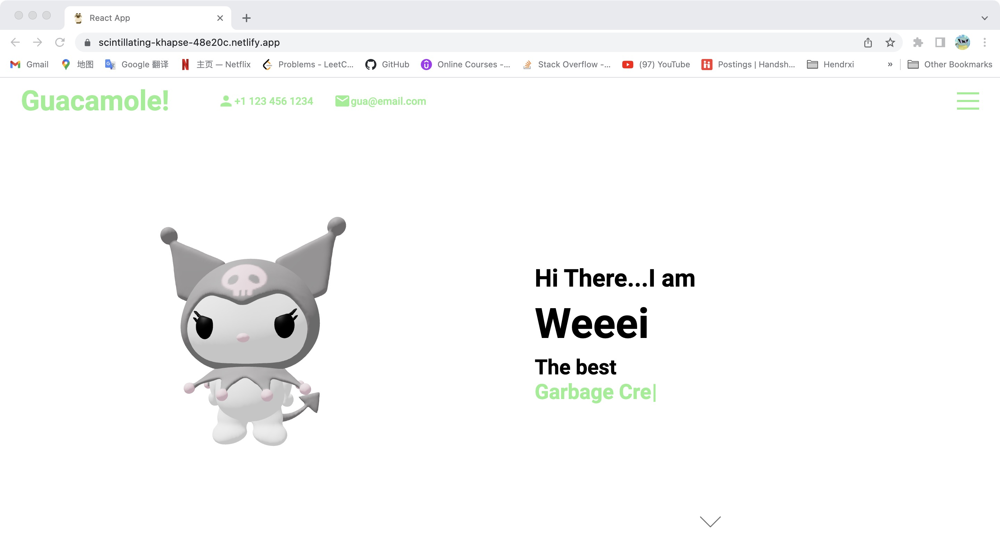

# Deploy 3D models with Create React App

This project tries to deploy a 3D model made from Blender into a porfolio website based on react.

## Website

website: https://scintillating-khapse-48e20c.netlify.app

In the project directory, you can run:

### `npm start`

## Todo

- update website styles
- update the 3D model (could be better..)
- \*\*\*add interactive moving feature to the model
- update the web content

## Update records

- 0811: upload it to github
- 0818: upload the original model with animation
